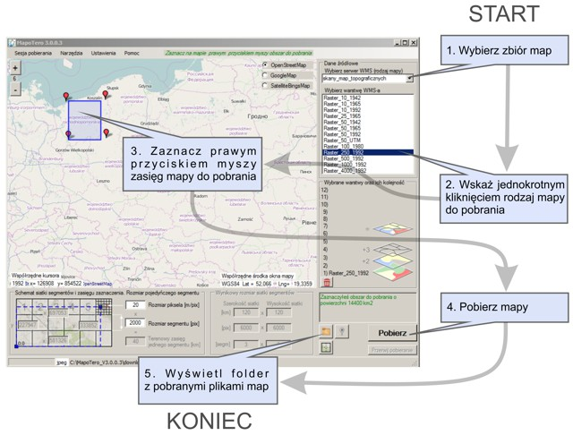
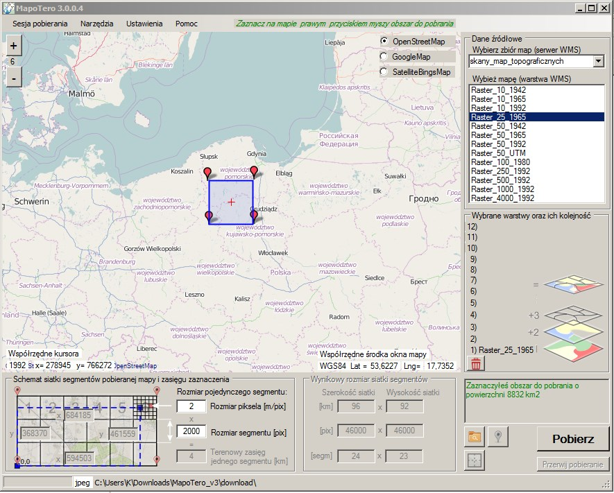
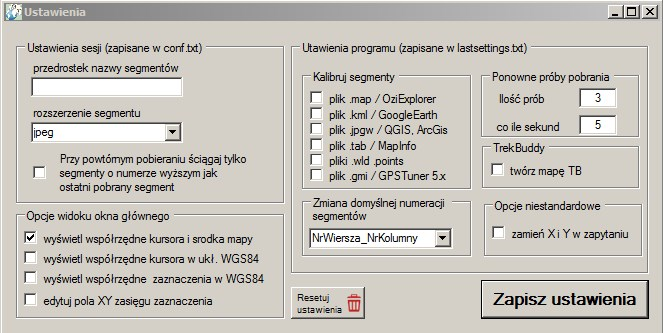

# MapoTero

**MapoTero** to darmowy program służący do pobierania rastrowych map z internetu, opublikowanych za pośrednictwem serwerów WMS (takich jak Geoportal2, PIG, GDOŚ) oraz usług kafelkowych WMTS. 

Program pobiera mapy, dzieląc wybrany obszar na siatkę kwadratowych segmentów (do 2048×2048 px). Pobrane segmenty map można następnie:
* **scalić w jeden duży plik rastrowy** (GeoTIFF, JPEG, PNG) przy użyciu wbudowanej funkcji *"złącz pobrane segmenty w jeden arkusz"*,
* **wyeksportować do map dla odbiorników GPS i aplikacji mobilnych:** KMZ (Garmin Custom Maps, Locus Map, OruxMaps) i MBTiles (Locus Map, OsmAnd, OruxMaps),
* **wgrać do urządzeń GPS** i aplikacji turystycznych (np. [TrekBuddy](http://www.trekbuddy.net/forum/index.php), [OziExplorer](http://www.oziexplorer.com/)),
* **wyświetlić jako podkład georeferencyjny** w programach GIS i GPS: [QGIS](https://www.qgis.org/), [Google Earth](https://www.google.pl/intl/pl/earth/), ArcGIS, GPS Tuner, MapInfo.

* **Obsługiwane formaty rastrowe:** JPEG, TIFF, PNG, GIF; arkusze scalone: GeoTIFF, JPEG, PNG.
* **Obsługiwane formaty georeferencji:** MAP, KML, TAB, JPGW, WLD, GMI, PRJ.
* **Układy współrzędnych:** PL-1992, PL-2000 (strefy 5-8), UTM (strefy 33N-35N), WGS84.

---

## Pobieranie

Najnowsze wydania programu można pobrać z zakładki **[Releases](https://github.com/Eksploracja/MapoTero/releases)**:
* 📥 [Pobierz najnowszą wersję MapoTero z GitHub Releases](https://github.com/Eksploracja/MapoTero/releases)

---

## Aktualności

* **Wersja 3.12:**
  * Przejście na platformę .NET 8 (program 64-bitowy) i aktualizacja bibliotek zależnych (GMap.NET, SQLite); automatyczna kompilacja i testy w GitHub Actions,
  * Pobieranie z usług WMTS: wystarczy podać w pliku zbioru map adres usługi WMTS (przykład: zbiór *ortofotomapa_WMTS*); program sam wybiera poziom kafli odpowiadający rozmiarowi piksela, a segmenty składa z kafli i w razie potrzeby przelicza do wybranego układu - mają te same pliki georeferencji co segmenty WMS,
  * Wybór układu współrzędnych segmentów: PL-1992, PL-2000 (strefy 5-8), UTM 33N-35N, WGS84 - współrzędne obszaru i rozmiar piksela przeliczane są przy zmianie układu, a pliki georeferencji zapisywane w wybranym układzie,
  * Wbudowane scalanie segmentów do GeoTIFF (także BigTIFF, kompresja Deflate lub JPEG), JPEG i PNG - zamiast zewnętrznego programu NoToCONS; arkusz zapisywany jest strumieniowo, więc jego wielkość nie jest ograniczona pamięcią RAM,
  * Eksport mapy (menu Narzędzia > Eksport mapy, Ctrl+E) do KMZ dla odbiorników Garmin (kafle do 1024 px, limit liczby kafli), KMZ dla Locus Map / OruxMaps i MBTiles z piramidą poziomów powiększenia,
  * Kilka segmentów pobieranych jednocześnie (liczba wątków w ustawieniach), przerywanie pobierania w dowolnej chwili, okno programu nie zamraża się podczas pobierania i scalania,
  * Parametr SERVICE=WMS dodawany do zapytań (wymagany przez serwery MapServer i GeoServer), kolejność osi w zapytaniach WMS 1.3.0 zgodna z definicją układu, a opcja zamiany X i Y dotyczy tylko zapytania - nie zamienia współrzędnych zapisywanych w plikach georeferencji,
  * Domyślny podkład mapy OpenStreetMap, ostre wyświetlanie okien na ekranach o dużej rozdzielczości (skalowanie DPI),
  * Przeliczenia współrzędnych w jednej, dokładnej implementacji (szereg Krügera, zgodność z biblioteką PROJ do 1 mm) i testy jednostkowe biblioteki MapoTero.Core,
  * Uporządkowanie struktury projektu i usunięcie przestarzałego kodu v2,
  * Poprawki konfiguracji kompilacji i wsparcia dla nowoczesnych środowisk Visual Studio,
  * Naprawa ponawiania pobierania nieudanych segmentów (ustawienia "ilość prób" i "przerwa między próbami" nie były uwzględniane); okno programu nie zamraża się podczas oczekiwania na kolejną próbę,
  * Odporniejsze pobieranie segmentów: limit czasu połączenia, zapis obrazu bez ponownej kompresji JPEG, przyczyna błędu (np. komunikat serwera WMS) zapisywana w pliku error.txt,
  * Naprawa wznawiania pobierania przy numeracji segmentów NrWiersza_NrKolumny,
  * Naprawa wczytywania sesji z pliku conf.txt za jednym razem oraz zawieszania się programu przy starcie, gdy zapisany zbiór map nie istnieje,
  * Scalanie segmentów zgłasza sukces dopiero po faktycznym utworzeniu arkusza; pliki georeferencyjne scalonego arkusza zapisywane są obok niego, z poprawną nazwą i rozszerzeniem pliku,
  * Naprawa awarii przy tworzeniu plików .points dla formatu PNG oraz błędnych współrzędnych pikselowych w pliku .tab scalonego arkusza,
  * Nakładanie map: zwalnianie pamięci po każdym segmencie i obsługa plików PNG z paletą barw (png8),
  * Usuwanie pustych segmentów: brak limitu 10 000 plików, usuwanie także plików .kml, .pngw i .png.points,
  * Gdy w katalogu programu nie można zapisywać (np. Program Files), ustawienia i pobrane mapy trafiają do %LocalAppData%\MapoTero,
  * Dokładna kalibracja plików KML: zapis dokładnych narożników obrazu (gx:LatLonQuad) oraz LatLonBox z obrotem uwzględniającym zbieżność południków - dawniej kafle na wschodzie i zachodzie Polski były w KML obrócone i przeskalowane (przesunięcie narożników kafla 1 km o ok. 40 m),
  * Pliki world file (.jpgw, .pngw, ...) podają środek lewego górnego piksela zgodnie ze standardem (dawniej przesunięcie o pół piksela),
  * Dokładny zasięg segmentów o niecałkowitym wymiarze terenowym (np. 0,1 m x 2048 px) i zapis liczb z kropką dziesiętną niezależnie od ustawień regionalnych systemu,
  * Usunięcie nieużywanych bibliotek (GMap.NET.WindowsPresentation, System.Text.Encoding.CodePages) i wersji testowych (preview) bibliotek.
* **19.10.2021 – Wersja 3.11:**
  * Naprawa niedziałającej warstwy Ortofotomapa,
  * Aktualizacja adresów warstw WMS.
* **20.10.2020 – Wersja 3.10:**
  * Usunięcie usterki związanej z niewyświetlaniem podkładowej warstwy OpenStreetMap w systemie Windows 10,
  * Aktualizacja warstw WMS,
  * Zmiana platformy programistycznej .NET Framework z wersji 4.5 na 4.7.2.
* **09.09.2019 – Wersja 3.0.0.9:**
  * Aktualizacja warstw WMS,
  * Zmiana platformy programistycznej .NET Framework z wersji 3.5 na 4.5,
  * Naprawa błędu wyświetlania podkładowej warstwy OpenStreetMap.

---

## Skrócona instrukcja obsługi

1. **Wybór zbioru map:** Wybierz z listy po prawej stronie okna programu zbiór map, z którego chcesz pobrać dane (lub pozostaw domyślny zbiór *"skany map topograficznych"*).
2. **Wybór warstwy:** Kliknij jednokrotnie lewym przyciskiem myszy na interesującą Cię warstwę (np. *"Raster_25_1965"* – mapa 1:25 000 w układzie 1965, lub *"Raster_10_1965"*). Nazwa zaznaczonej warstwy wyświetli się w polu *"Wybrane warstwy"*.
3. **Zaznaczenie obszaru:** Na podglądzie mapy zaznacz prawym przyciskiem myszy zasięg pobieranego obszaru.
4. **Pobieranie:** Kliknij przycisk **"Pobierz"**. Rozpocznie się pobieranie segmentów do katalogu `download`.
5. **Przeglądanie i scalanie:**
   * Kliknij żółty folder, aby otworzyć katalog z pobranymi plikami.
   * Opcjonalnie scal pobrane segmenty w jeden arkusz ikoną szachownicy (*"scal pobrane segmenty..."*), wybierając format arkusza (GeoTIFF, JPEG lub PNG). Arkusz zapisywany jest strumieniowo, więc może mieć dowolną wielkość (JPEG - do 65 500 px na bok).
   * Opcjonalnie wyeksportuj mapę do KMZ lub MBTiles (*Narzędzia > Eksport mapy*), aby wgrać ją do odbiornika GPS lub aplikacji mobilnej.

---

## Wygląd okien programu

### Główne okno programu

### Okno ustawień

---

## Obsługiwane serwery WMS i WMTS

* **Geoportal2** (Główny Urząd Geodezji i Kartografii)
* **Państwowy Instytut Geologiczny (PIG)**
* **Generalna Dyrekcja Ochrony Środowiska (GDOŚ)**

Zbiory map to pliki tekstowe w katalogu `warstwy`: w pierwszym wierszu adres serwera, dalej pary wierszy - nazwa warstwy i zalecany rozmiar piksela. Adres usługi WMTS (np. zawierający `SERVICE=WMTS` lub `/WMTS`) oznacza pobieranie kafli WMTS; nazwą warstwy jest wtedy identyfikator warstwy z dokumentu GetCapabilities usługi.

---

## Kompilacja

* Wymagany Visual Studio 2022 (wersja 17.8 lub nowsza) z obsługą .NET 8 albo samo .NET 8 SDK.
* Kompilacja programu: `dotnet build MapoTero_v3.vbproj -c Release`, testy jednostkowe: `dotnet test MapoTero.Tests/MapoTero.Tests.vbproj`.
* Każda zmiana w repozytorium jest kompilowana i testowana w GitHub Actions; gotowy program można pobrać jako artefakt *MapoTero* z zakładki **Actions**.
* Do uruchomienia programu potrzebne jest środowisko [.NET Desktop Runtime 8](https://dotnet.microsoft.com/download/dotnet/8.0) (x64).

---

## Źródła informacji i społeczność

* Dyskusja i wsparcie: dział *"Programy GPS/GIS wspierające eksplorację"* na [Pomorskim Forum Eksploracyjnym](https://forum.eksploracja.pl/viewforum.php?f=205)
* Fanpage Facebook: [facebook.com/mapotero.opensource](https://www.facebook.com/mapotero.opensource)

---

## Zespół projektu

* **Twórca programu:** Pajakt (2009–2014)
* **Rozwój projektu:** [Kazimierz Niecikowski](http://labgis.pl/) (od 2015)
* **Współpraca programistyczna:**
  * Paweł_gdn
  * AAA222 (moduł NoTo - scalanie segmentów do wersji 3.11)
  * Edward Zadorski (kod modułu przeliczania współrzędnych)

---

## Alternatywne rozwiązania

* **Kafelkarz** (autor: AAA222) – program umożliwiający pobieranie danych zarówno z serwerów WMS, jak i WMTS.

---

## Licencja

Program jest wolnym oprogramowaniem udostępnianym na warunkach licencji **GNU General Public License v3 (GPLv3)**. Szczegóły licencji znajdują się w pliku [LICENSE](LICENSE).
